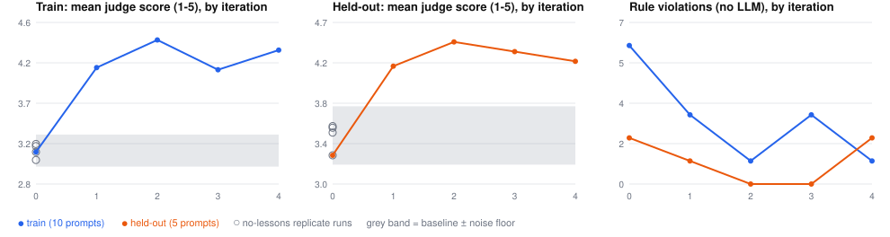
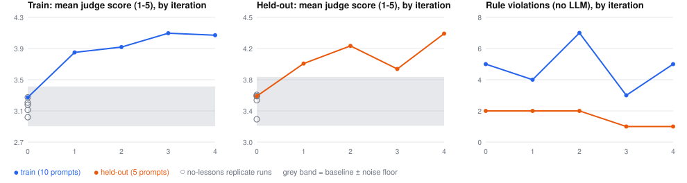

# Can an agent improve itself in-context? A small, honest experiment

**Short answer:** on the system I tested, yes — in two independent runs, with
caveats that matter more than the headline. `eval/README.md` is the
chronological engineering log; this is the version to read first.

## TL;DR

I built a closed loop around my fitness-coaching agent (`app/`): score its
outputs against a rubric with an LLM judge, extract *general lessons* from its
low-scoring responses, inject those lessons into its system prompt, repeat.
No fine-tuning; the only thing that changes is the prompt.

- On a **Haiku 4.5** agent, **two independent runs of the whole loop** each
  raised the judge's mean score by **+0.9 to +1.15** (train) and **+0.76 to
  +0.83** (held-out prompts the lesson-writer never saw), on a 1-5 scale.
  Both clear the pre-registered noise floor (0.18-0.30) by a wide margin.
- **It is a step, not a climb.** Most of the gain lands after the first three
  lessons; later iterations plateau and wobble.
- **The two runs improved different things.** Run 1 fixed tool-use *process*
  (an objective, judge-independent check confirms it). Run 2 improved
  personalization, communication, and safety scores, but its objective
  tool-use check barely moved. So the judge-score result replicated; the
  objective corroboration did not.
- **Not shown:** that this works on a stronger agent (Opus had no headroom),
  that it's "better coaching" rather than "better at what my rubric rewards,"
  or anything a human has validated. Details below.

## The setup

**System under test:** a tool-calling fitness agent (raw Anthropic API, four
tools: exercise lookup, set logging, history, and a terminal `emit_plan` whose
input is Pydantic-validated). Deployed and unchanged — the experiment lives in
`eval/` and never edits `app/`.

**The loop, per iteration** (`eval/loop.py`): run the agent on 15 fixed
prompts against identically-seeded fixture databases -> score each output 3x
with an LLM judge (Opus 5) on four 1-5 dimensions (tool-use correctness,
safety, personalization, communication) -> for train-split outputs scoring
below 3.5, have an extractor write up to 3 lessons -> freeze the lessons that
will be active for the next iteration.

**Instruments, and why there are several:**

| Instrument | What it is | What it guards against |
|---|---|---|
| Rubric judge | Opus scores 4 dimensions, evidence written before each score | the main measurement |
| Rule checks (`eval/rules.py`) | deterministic counts from the tool trace: history never checked, plan exercises never verified, wrong number of `log_set`s, tool errors, no valid plan | judge blind spots (no LLM involved) |
| Held-out split | 5 prompts, same failure categories, different surface details; extractor never sees them | lessons that memorize the test set |
| Leakage lint | rejects any lesson naming a library exercise or copying 5 words from any eval prompt | same |
| No-lessons replicates | 4-5 runs of the unmodified agent | agent sampling noise |
| Blind pairwise | Opus picks the better of two responses, no rubric, randomized + position-balanced, told not to favor length | rubric/extractor sharing a source; length bias |

## What I fixed in advance

Before any lesson was extracted, I wrote down (README, "Pre-registered for the
loop"): the held-out split, the lint, the 3.5 threshold, the caps, the noise
floor rule, and the success criterion. **A gain counts only if the final
iteration's held-out mean exceeds the no-lessons mean by more than the largest
gap seen between any two no-lessons runs, and held-out rule violations aren't
higher than baseline.** Train-only gains are reported as overfitting. Before
the second loop and the pairwise control, I wrote their pass criteria too, and
committed to describing run 1 as "not reproduced" if run 2 failed.

## Results

Cells are `mean judge score / rule violations`.

| iter | Loop 1 train | Loop 1 held-out | Loop 2 train | Loop 2 held-out |
|---|---|---|---|---|
| 0 (no lessons) | 3.14 / 6 | 3.28 / 2 | 3.30 / 5 | 3.57 / 2 |
| 1 | 4.11 / 3 | 4.20 / 1 | 3.87 / 4 | 3.97 / 2 |
| 2 | 4.42 / 1 | 4.45 / 0 | 3.93 / 7 | 4.18 / 2 |
| 3 | 4.08 / 3 | 4.35 / 0 | 4.11 / 3 | 3.90 / 1 |
| 4 | 4.31 / 1 | 4.25 / 2 | 4.08 / 5 | 4.33 / 1 |




**Pre-registered verdict (mechanical, `eval/trend.py`):**

| | baseline (n runs) | noise floor | final | gain | verdict |
|---|---|---|---|---|---|
| Loop 1 train | 3.158 (4) | 0.183 | 4.308 | +1.150 | beats floor |
| Loop 1 held-out | 3.487 (4) | 0.300 | 4.250 | +0.763 | beats floor |
| Loop 2 train | 3.187 (5) | 0.250 | 4.083 | +0.897 | beats floor |
| Loop 2 held-out | 3.503 (5) | 0.300 | 4.333 | +0.830 | beats floor |

Both loops: **real improvement = YES**; the overfitting flag fired for neither.
Held-out violations: loop 1 2.0 -> 2 (met only by equality), loop 2 2.0 -> 1.

**Where the gain came from differs between runs** (train dimensions, iter 0 -> 4):

| | tool use | safety | personalization | communication |
|---|---|---|---|---|
| Loop 1 | 3.13 -> **4.53** | 2.97 -> 4.03 | 3.50 -> 4.60 | 2.97 -> 4.07 |
| Loop 2 | 3.37 -> **3.67** | 3.30 -> 4.00 | 3.27 -> 4.47 | 3.27 -> 4.20 |

Tool use is the only dimension with an objective check, and it's the one
where the runs diverge. Loop 2 wrote an explicit "never call `emit_plan`
until every exercise name has come back from a lookup" lesson at iteration 3
and the agent still left 3 unverified exercises at iteration 4; loop 1's
similar lesson worked. A small model following a process instruction is
evidently a coin-flip-ish thing, and one run could not have shown that.

## How much to trust the measurements

| Check | Result |
|---|---|
| Judge self-consistency (3 independent scorings per output) | 0% of cells disagreed by 2+ points at every one of 12 scored runs; exact agreement 60-77% |
| Judge tool-use score vs objective violations, 150 outputs | Pearson r = **-0.84**; no-violation outputs avg 4.54, outputs with a violation avg 2.51 |
| Judge length bias (no lessons, 60 outputs) | r = +0.32 — real. At that slope, longer summaries explain at most ~0.18-0.22 points of a 0.76-1.15 gain |
| Pairwise **negative control** (no-lessons vs no-lessons) | 54.4% win rate, CI 38-70% -> **passed** (needed 35-65%, CI containing 50%) |
| Pairwise, loop 1 final vs no-lessons | 57 wins / 0 losses / 3 ties = 97.5% (CI 94-100%) |
| Pairwise, loop 2 final vs no-lessons | 53 / 5 / 2 = 90.0% (CI 76-99%) |

The pairwise judge separating the two loops (97.5% vs 90%), picking a baseline
5 times in loop 2, and landing at ~50% on the control is what convinces me
it isn't just rubber-stamping the later run. It is **not independent
confirmation**: it's the same judge model on the same outputs, so correlated
errors are possible, and the control can't detect a preference for the *style*
the lessons induce. The control did show a mild length lean (a longer summary
won 62.5% of 16 vs 50% of 29), and loop 2 shows it more (93.5% vs 78.6%).

## What I'd claim, and what I wouldn't

**I'd claim:** on these 15 prompts, with a Haiku-4.5 agent, injecting a handful
of extracted lessons produced a large judge-score improvement that exceeds
measured noise, holds on held-out prompts, reproduced across two independent
loop runs, and is corroborated by a blind preference check that passed its
negative control.

**I wouldn't claim:**
- **That it generalizes** beyond these prompts, this agent, or this rubric. The
  eval set is 15 prompts; the agent is one small model.
- **That it works on a stronger agent.** Opus 5 scored 4.84/5 at baseline —
  no headroom to test. This is a result about a model with real, learnable
  failures, which is exactly why I switched to Haiku.
- **That it's "better coaching."** The extractor learns from the judge's
  evidence, and the judge grades against the rubric. Several lessons are
  *sharpened restatements of instructions the agent already had* ("call
  `look_up_exercise` if you're not certain" became "for EVERY exercise").
  What improved is measured against a rubric I wrote; no human graded a
  single output.
- **A monotone trend.** Both runs jump early and then plateau or wobble
  (loop 1 held-out at the end is below its iteration-2 peak).
- **That the loop keeps learning.** Both runs *stopped extracting* once every
  train output cleared the 3.5 threshold (after iteration 2 in loop 1, after
  iteration 3 in loop 2): 9 lessons each, not the 12 allowed.

## What went wrong along the way (the useful part)

- **The first plan had no headroom.** The Opus baseline was at the ceiling, so
  a score trend would have proven nothing. I caught it because I pre-registered
  a headroom check before running anything, then changed the agent under test.
- **Forced tool calls fail on anything but flat scalar fields** — three times
  in two places: nested objects (the judge, twice, in two different ways) and
  an array (the lesson extractor).
  Pydantic validation turned each from "silently garbage" into a readable
  error. Rule adopted: flat schemas only.
- **The model can't count characters.** Length caps of 300, 400 (both on
  lessons), and 1200 (the pairwise judge) all failed; the 400 case failed
  even with the validation error fed back. Now: brevity in *words* in the
  prompt, plus a generous backstop. I re-made this mistake on Day 4 after
  documenting it on Day 3.
- **My first retry re-sent the identical request**, so a validation failure
  repeated verbatim. Retries now feed the specific error back.
- **A crash taught me the harness was measuring the wrong thing.** One turn
  failed to produce a valid plan (likely the 500-char summary schema limit,
  which the lessons push against) and the loop crashed, destroying the other
  14 results. A failed turn is a legitimate failure of the system under test,
  so it is now recorded and scored 1 on every dimension. Summaries reached 498
  and 499 of 500 characters in later iterations, so this can still happen; the
  reported runs happened to have none.
- **Process lapses, disclosed:** while diagnosing that crash I saw one
  iteration's scores mid-run (no code changed because of it); the crashed
  iteration was re-drawn; credits ran out twice (mid-run and mid-check); and a
  `gather` without `return_exceptions` discarded ~59 paid API calls. A chart I
  had only checked as well-formed XML turned out to crop at narrow widths.
- **A number I stated from memory was wrong** (8 rule violations; it was 9).

## What's not here

No human-labeled data. No agent other than Haiku 4.5, no judge from another
model family. Only 15 prompts and one lesson-extraction design. Two loop runs,
not enough to estimate loop-to-loop variance beyond "they differ." No
statistical test on the trend itself — the noise floor is the largest gap
among 4-5 no-lessons runs, which likely *underestimates* true run-to-run
spread, though it was clearly beaten. And nothing about whether lessons stay
useful as a prompt grows past ~10 items.

## Cost and reproducing

Measured token counts at list price: about $14.8 of Opus + $1.3 of Haiku for
loop 1, its two extra no-lessons replicates, and its pairwise check; about
$12.2 + $0.9 for loop 2, the pairwise control, and loop 2's pairwise check —
roughly **$30 for the results reported here**. That excludes the earlier
dry run, the crashed attempt, and the discarded first pairwise batch. Loops are
resumable; every step's output is a file and finished steps are skipped.

```bash
python -m eval.loop --tag loop --iterations 5
python -m eval.trend --tag loop --iterations 5 \
    --replicates iteration_0_dry iteration_0_rep1 iteration_0_rep2
python -m eval.pairwise --final iteration_4_loop \
    --baselines iteration_0_loop iteration_0_dry iteration_0_rep1 iteration_0_rep2
```

Needs `ANTHROPIC_API_KEY`. The agent model is `eval/config.py` (Haiku 4.5),
independent of the deployed app's model.
